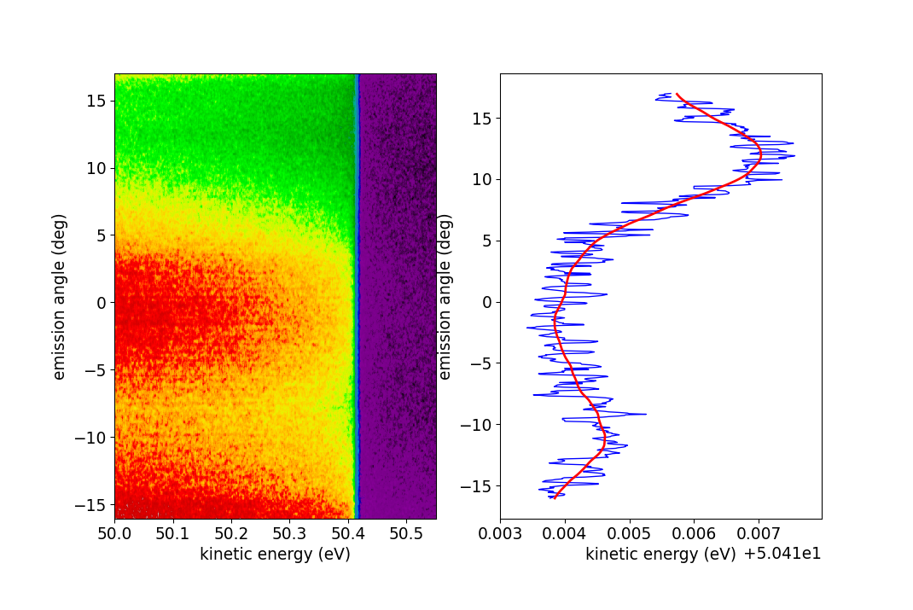
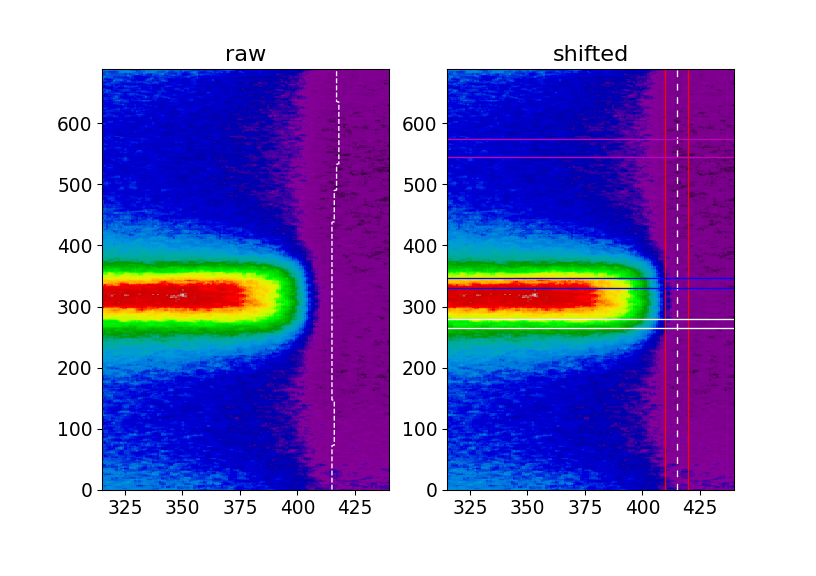
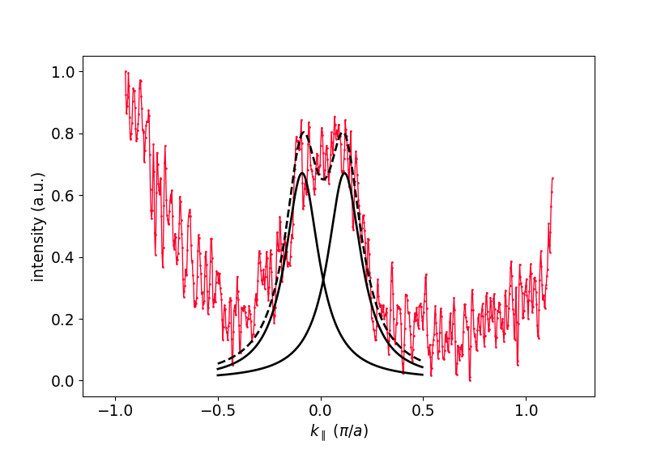
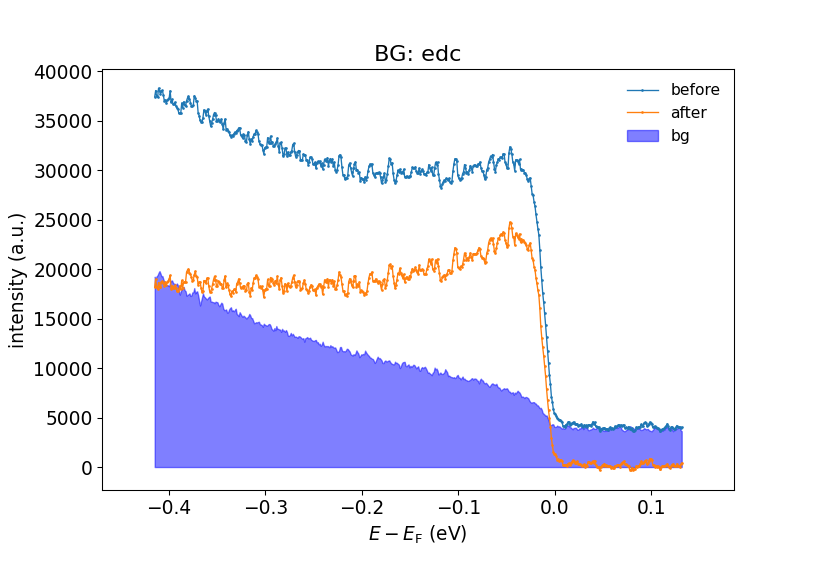
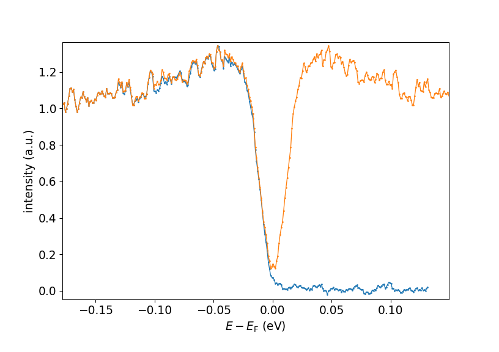

Gap Analysis
============

This example explains the procedure that is necessary to analyse a gap (e.g. 
a superconducting gap) from an ARPES spectrum with ``arpys``.

Throughout the example we will assume that we have a file 'spectrum.p' 
containing the ARPES spectrum and 'gold.p' with the corresponding gold 
reference data, and that they have been loaded with 
:func:`~arpys.dataloaders.load_data` and saved as ``D`` and ``G`` 
respectively.  
Also, the ``dataloading`` and ``postprocessing`` modules have been loaded:: 

   from arpys import dl,pp

1. Adjust Fermi level
---------------------

First off, we need to precisely determine the Fermi level (which can vary 
across angular channels).
This is done by fitting a Fermi-Dirac distribution convoluted by a Gaussian 
to simulate the instrument resolution to each EDC.
Often it helps to add some additional linear components to the fit function, 
as is done in :func:`~arpys.postprocessing.fermi_fit_func`.

1.1 Fermi fit
^^^^^^^^^^^^^

This process is automated in :func:`~arpys.postprocessing.fig_gold_array` 
(the more convenient method of using :func:`~arpys.postprocessing.fit_gold` 
relies on a specific organization of the data within ``G`` and is therefore 
less recommended).
If we know that the energies lie along ``G.xscale`` and the shape of 
``G.data`` is ``(1, n_angles, n_energies)`` we would do::
   
   levels, sigmas, slopes, offsets, functions = pp.fit_gold_array(G.data[0], 
                                                G.xscale, ef, T)

where ``ef`` is a starting guess for the Fermi level and ``T`` is the 
temperature at which the spectrum was taken.

.. note::
   If the shape of ``G.data`` differs from the above, we would need to 
   reorganize it first. Ultimately, 
   :func:`~arpys.postprocessing.fit_gold_array` expects a 2d array of shape 
   ``(n_angles, n_energies)``.

Confer the documentation of :func:`~arpys.postprocessing.fit_gold_array` for 
explanation of its output.
You will mostly need the ``levels`` only, but all the other output is useful 
for checking whether the fit worked reasonably.

.. note::
   You may notice that the execution of the above command may take some 
   time. 
   This is because there are ``n_angles`` fitting procedures that need 
   to be carried out.
   If you have confirmed that the fitting worked reasonably well, it is 
   therefore a good idea to store the result in some form, and just load it 
   in again, whenever needed, instead of always carrying out the fit.
   One way of achieving this is by using ``pickle``::

      import pickle
      with open('my_file_to_store_gold_fit_results.p', 'wb') as f :
         pickle.dump(levels, f)

   The ``levels`` can then be loaded by::

      with open('my_file_to_store_gold_fit_results.p', 'rb') as f :
         levels = pickle.load(f)

   Of course you can store more than just the levels.
   This is a nice way of storing arbitrary python objects (however, some 
   objects cannot be *pickled*, like for example the ``functions``).

.. _sec_smoothing:

1.2 Smoothing
^^^^^^^^^^^^^

Since the ``levels`` are usually quite noisy, it is recommended to apply some 
operation to get a *nicer* curve. One way is to smoothen it (e.g. using 
:func:`arpys.postprocessing.smooth`) or to fit a polynomial to the ``levels``.
The following figure shows what this could look like.

   Fermi level fitting. To the left we see a false color plot of the gold 
   spectrum. Clearly the Fermi level is closely above 50.4 eV, which is what 
   was given as the starting guess for 
   :func:`~arpys.postprocessing.fig_gold_array`.
   To the right, the resulting ``levels`` are plotted against the angles 
   (``G.xscale`` in this example) in blue. Clearly, this result is rather noisy.
   The red line shows a smoothed version of the blue curve.

1.3 Applying to data
^^^^^^^^^^^^^^^^^^^^

Once we have our levels, we can use them to *straighten* our Fermi level in 
the spectrum.
If we just want to plot the data, we can apply the ``levels`` continuously, 
with the helper function :func:`~arpys.postprocessing.adjust_fermi_level`, 
which returns an energy mesh of shape ``(n_energies, n_angles)`` that can be 
given to the :meth:`~matplotlib.axes.Axes.pcolormesh` function.

However, if we are interested in further analysis (which we are in this 
example), we need to apply the energy shifts discretely, in pixel units (the 
follwoing assumes the same structure of ``D`` as we had for ``G`` before and 
``levels`` is the smoothened result of section :ref:`sec_smoothing`)::

   pixel_shifts = pp.get_pixel_shifts(G.xscale, levels)
   data, cutoff = pp.apply_pixel_shifts(D.data[0], pixel_shifts)

.. _fig_fermi_shifts:

   Application of the Fermi level correction.
   Left (*raw*) we see a part of our spectrum plotted in pixel coordinates 
   with the curvy Fermi level indicated by the white dashed line.
   Right (*shifted*) the Fermi level has been adjusted and the white dashed 
   line is straight.
   The red lines indicate the integration regime we will use for MDC 
   extraction, the magenta lines show where we extract our background EDC 
   from and the blue and white horizontal lines show where the actual EDCs at 
   :math:`k_\mathrm{F}` are taken from.

2. Finding :math:`k_\mathrm{F}`
-------------------------------

As a next step, in order to extract the EDCs at :math:`k_\mathrm{F}`, we need 
to find it (them, actually, as there is one to the left and one to the right 
in this example) by fitting Lorentzians to the MDC at :math:`E_\mathrm{F}`.  
Useful functions in that context are 
:func:`~arpys.utilities.functions.indexof` to get the index of the Fermi energy,
:func:`~arpys.utilities.functions.lorentzian` and of course scipy's 
:func:`scipy.optimize.curve_fit`.

.. note::
   At this point you can of course work in pixel, angular or k coordinates, 
   your choice.
   Be reminded of :func:`arpys.postprocessing.angle_to_k` for the conversion 
   to k space.

The details of the fit can be left up to you.
It can be helpful to try fitting only the relevant region along k, as can be 
seen in the figure, where the fit only considered the region where the black 
lines are drawn.

   Extracted MDC and fitted Lorentzian curves.

3. EDC extraction and processing
--------------------------------

Now that we know :math:`k_\mathrm{F}`, we can extract the EDCs from the data 
(as indicated in the :ref:`figure above <fig_fermi_shifts>`), subtract 
background and symmetrize.

3.1 Background subtraction
^^^^^^^^^^^^^^^^^^^^^^^^^^

Of course, different situations may require different treatments of the 
background.
Here are two common possibilities:

   * Extract an EDC in a band-free region of the data, possibly smoothen it 
     and use that as the background.
   * :func:`~arpys.postprocessing.subtract_bg_matt`. A simple and intuitive 
     method that has proven useful.

   Background subtraction. Here the simple EDC subtraction method is used.

3.2 Symmetrization
^^^^^^^^^^^^^^^^^^

Finally, you can use :func:`arpys.postprocessing.symmetrize_linear` to 
symmetrize the EDC around :math:`E_\mathrm{F}`::
   
   sym_edc, sym_energy = pp.symmetrize_linear(edc, ef_index, D.xscale)

   Original (blue) and symmetrized (orange) EDCs.

